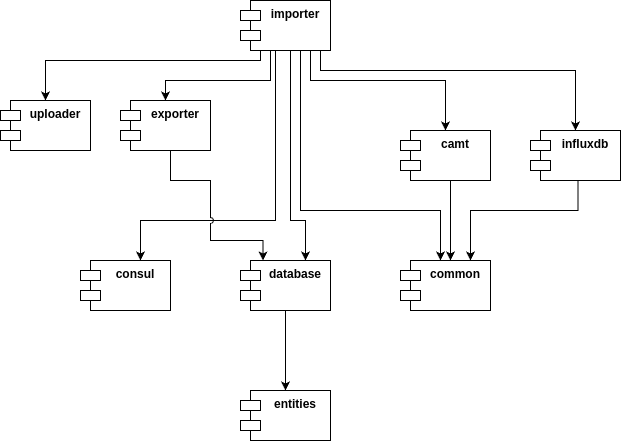

This application follows an orthogonal architecture:



## Code Style and Formatting

This project uses comprehensive code formatting and quality standards to ensure consistency across the team.

### Formatting Configuration

The project includes multiple formatting configuration files to ensure consistent code style:

1. **IntelliJ IDEA Code Style** (`.idea/codeStyles/`)
   - `Project.xml`: Complete IntelliJ formatting rules aligned with Checkstyle
   - `codeStyleConfig.xml`: Marks the Project style as shared for team consistency

2. **Cross-IDE Compatibility** (`.editorconfig`)
   - Basic formatting rules that work across different IDEs
   - Ensures consistent indentation and line endings

3. **Checkstyle Configuration** (`config/checkstyle/`)
   - `checkstyle.xml`: Comprehensive code quality rules
   - `checkstyle-simple.xml`: Simplified rules for quick checks
   - `suppressions.xml`: Exclusions for generated code

### Key Formatting Standards

- **Line Length**: 120 characters maximum
- **Indentation**: 4 spaces for Java files
- **No Tabs**: Use spaces exclusively
- **Import Organization**: Alphabetical order, no wildcard imports
- **Brace Style**: K&R style (opening brace on same line)
- **Method Length**: Maximum 50 lines
- **Parameter Count**: Maximum 7 parameters

### IDE Setup

#### IntelliJ IDEA
The project code style will be automatically detected when you open the project. Ensure:
1. Checkstyle plugin is installed
2. Project code style is selected in Settings → Editor → Code Style → Java
3. Enable "Reformat on commit" for optimal consistency

#### Other IDEs
Install EditorConfig support and the Checkstyle plugin to maintain consistent formatting.

### Quality Enforcement

Code formatting is enforced through:
- Checkstyle Gradle task (`./gradlew checkstyleMain checkstyleTest`)
- Git hooks (if configured)
- CI/CD pipeline validation

### Formatting Commands

```bash
# Check code style violations
./gradlew checkstyleMain checkstyleTest

# Reformat code in IntelliJ
Ctrl+Alt+L (or Cmd+Option+L on macOS)
```