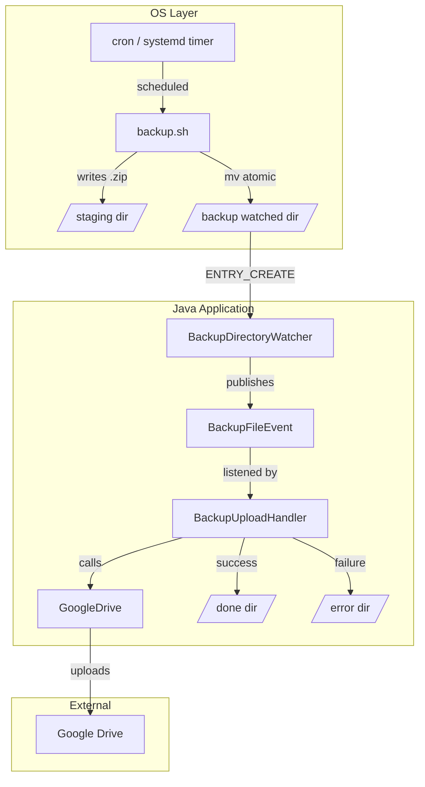

# Appraisal: Backup → File Listener → Google Drive Upload

## Proposed Idea

Schedule `backup.sh` via OS cron, have it write the encrypted `.zip` to a watched directory, let the existing Java [`DirectoryWatcher`](importer/src/main/java/com/marvin/app/service/DirectoryWatcher.java:23) detect the new file, and trigger the [`Uploader`](uploader/src/main/java/com/marvin/upload/Uploader.java:20) to push it to Google Drive.


---

## What Already Exists

| Component | Role | Key Details |
|-----------|------|-------------|
| [`backup.sh`](backup/backup.sh:1) | Dumps DB, encrypts with hybrid RSA+AES, produces a single `.zip` | Output dir configurable via `--output-dir` or `BACKUP_DIR` |
| [`DirectoryWatcher`](importer/src/main/java/com/marvin/app/service/DirectoryWatcher.java:23) | Watches a single directory for `ENTRY_CREATE`, publishes [`NewFileEvent`](importer/src/main/java/com/marvin/app/model/event/NewFileEvent.java:5), moves file to `done` | Currently hardwired to CAMT import dirs via `camt.import.file.in` / `camt.import.file.done` |
| [`Delegator`](importer/src/main/java/com/marvin/app/service/Delegator.java:21) | Listens for `NewFileEvent`, parses CAMT XML, delegates to cost import services | Tightly coupled to CAMT/cost domain |
| [`Uploader`](uploader/src/main/java/com/marvin/upload/Uploader.java:20) | Zips files, uploads to Google Drive via service account, cleans up | Currently called programmatically, not event-driven |
| [`GoogleDrive`](uploader/src/main/java/com/marvin/upload/GoogleDrive.java:27) | Low-level Drive API wrapper: upload, list, delete | Reusable as-is |

---

## Assessment: The Idea Is Sound, But Needs Refinement

### ✅ Strengths

1. **Clean separation of concerns** — The OS handles scheduling, the shell script handles DB + crypto, Java handles upload. Each piece does one thing.
2. **Leverages existing infrastructure** — The `DirectoryWatcher` pattern and `GoogleDrive` client already work. No need to reinvent.
3. **No Java↔DB-dump coupling** — Keeping `pg_dump` + `openssl` in bash avoids pulling native dependencies into the JVM.
4. **Backup files are already self-contained** — The `.zip` contains both the encrypted data and the encrypted AES key, so the uploader needs zero knowledge of the encryption scheme.

### ⚠️ Issues That Need Addressing

#### 1. The current `DirectoryWatcher` is single-purpose

[`DirectoryWatcher`](importer/src/main/java/com/marvin/app/service/DirectoryWatcher.java:33) watches exactly one directory — `camt.import.file.in` — and moves files to `camt.import.file.done`. It publishes a generic [`NewFileEvent`](importer/src/main/java/com/marvin/app/model/event/NewFileEvent.java:5), but the only listener is [`Delegator`](importer/src/main/java/com/marvin/app/service/Delegator.java:51), which immediately tries to parse the file as CAMT XML.

If you point backup `.zip` files at the same directory, `Delegator` will attempt to parse them as CAMT and fail. If you create a second watched directory, you need a second watcher instance or a generalized watcher.

**Options:**
- **A) Generalize `DirectoryWatcher`** — Make it configurable for multiple directories, each with its own event type or discriminator. Listeners filter by file pattern.
- **B) Create a dedicated `BackupDirectoryWatcher`** — A separate `@Component` watching a backup-specific directory, publishing a different event type like `BackupFileEvent`. Simpler, no risk of breaking existing CAMT flow.

**Recommendation:** Option B. It is isolated, low-risk, and follows the existing pattern.

#### 2. The `Uploader` re-zips files unnecessarily

[`Uploader.zipAndUploadFiles()`](uploader/src/main/java/com/marvin/upload/Uploader.java:44) takes a list of paths, creates a *new* zip, uploads it, then deletes everything. But `backup.sh` already produces a final `.zip`. Re-zipping a zip is wasteful and changes the file structure.

**Recommendation:** Add a simpler method to `Uploader` — something like `uploadFile(Path file)` — that uploads a single pre-existing file directly without re-zipping. The existing [`GoogleDrive.uploadFile()`](uploader/src/main/java/com/marvin/upload/GoogleDrive.java:58) already supports this.

#### 3. Race condition: file not fully written when event fires

`WatchService` fires `ENTRY_CREATE` as soon as the file entry appears in the directory. For large backup files, the write may still be in progress. Reading or uploading a partially-written file will corrupt the upload.

**Mitigation strategies:**
- **Atomic move:** Have `backup.sh` write to a temp directory, then `mv` the final `.zip` into the watched directory. On the same filesystem, `mv` is atomic.
- **Sentinel file:** `backup.sh` writes a `.done` marker after the zip is complete. The watcher ignores `.zip` files and only reacts to `.done` files.
- **Poll for stability:** After detecting the file, wait until its size stops changing for N seconds before processing.

**Recommendation:** Atomic move is the simplest and most reliable. Modify `backup.sh` to write to a staging area and `mv` into the watched dir as the final step.

#### 4. Error handling and retry

What happens if the Google Drive upload fails? Currently [`Uploader`](uploader/src/main/java/com/marvin/upload/Uploader.java:97) throws an `IllegalStateException` and the file is lost from the watched directory because `DirectoryWatcher` already moved it to `done`.

**Recommendation:**
- Move to `done` only after successful upload.
- Move to an `error` directory on failure.
- Consider a simple retry mechanism or at minimum log enough context for manual retry.

#### 5. Uploader is currently disabled

In [`application.yaml`](boot/src/main/resources/application.yaml:36), `uploader.enabled: false`. The `parent-folder-name` is set to `backup` which happens to be a good fit, but you will need a separate config property for the backup upload target folder vs. the cost export folder.

#### 6. No feedback loop to verify upload

There is no record that a backup was uploaded, when, or its Drive file ID. If you need auditability, consider logging the upload result to the database or a local manifest file.

---

## Proposed Architecture



---

## Implementation Steps

If you decide to proceed, here is what needs to happen:

1. **Create `BackupFileEvent`** — A new event record similar to [`NewFileEvent`](importer/src/main/java/com/marvin/app/model/event/NewFileEvent.java:5) but for backup files.

2. **Create `BackupDirectoryWatcher`** — A new `@Component` in the importer module that watches a configurable backup directory and publishes `BackupFileEvent`. Follows the same pattern as [`DirectoryWatcher`](importer/src/main/java/com/marvin/app/service/DirectoryWatcher.java:23).

3. **Add `uploadFile(Path)` to `Uploader`** — A method that uploads a single file directly to Google Drive without re-zipping. Delegates to [`GoogleDrive.uploadFile()`](uploader/src/main/java/com/marvin/upload/GoogleDrive.java:58).

4. **Create `BackupUploadHandler`** — Listens for `BackupFileEvent`, calls the new `uploadFile` method, moves to `done` on success or `error` on failure.

5. **Add configuration properties** — New entries in [`application.yaml`](boot/src/main/resources/application.yaml:1):
   ```yaml
   backup:
     upload:
       enabled: false
       watch-dir: ${BACKUP_WATCH_DIR:./app/backup/in}
       done-dir: ${BACKUP_DONE_DIR:./app/backup/done}
       error-dir: ${BACKUP_ERROR_DIR:./app/backup/error}
       drive-folder-name: ${BACKUP_DRIVE_FOLDER:db-backups}
   ```

6. **Modify `backup.sh`** — Add atomic move: write to a staging directory, then `mv` the final `.zip` into the watched directory. Add a `--watch-dir` flag or use `BACKUP_WATCH_DIR` env var.

7. **Set up cron job** — e.g., `0 2 * * * /path/to/backup.sh --output-dir /tmp/backup-staging && mv /tmp/backup-staging/*.zip /app/backup/in/`

8. **Tests** — Unit tests for `BackupUploadHandler` and `BackupDirectoryWatcher`.

---

## Alternatives Considered

| Alternative | Pros | Cons |
|-------------|------|------|
| **Java calls `backup.sh` via `ProcessBuilder`** | Single orchestrator, no cron needed | Couples Java to shell scripts, harder to test, JVM process management complexity |
| **Java does the pg_dump + encryption natively** | Pure Java, no external dependencies | Massive effort, needs native `pg_dump` binary anyway, crypto reimplementation risk |
| **Dedicated backup microservice** | Clean separation | Over-engineered for this use case, another service to deploy and monitor |
| **Direct cron → `rclone`/`gdrive` CLI upload** | No Java involvement at all | Loses centralized logging/monitoring, separate credential management, no integration with existing app |

The file-watcher approach is the best balance of simplicity, reuse, and separation of concerns.

---

## Verdict

**The idea is good.** The file-watcher pattern is a proven integration technique, and you already have 90% of the pieces in place. The main work is:

- A dedicated backup watcher + event + handler — roughly 3 new small classes
- A direct-upload method on `Uploader` — a few lines
- Config properties and a small `backup.sh` tweak for atomic writes
- Proper error handling so failed uploads do not silently lose backup files
