# Cost Import Logic Documentation

## Table of Contents
1. [Overview](#overview)
2. [Architecture](#architecture)
3. [Component Overview](#component-overview)
4. [Cost Types and Filtering Logic](#cost-types-and-filtering-logic)
5. [Data Flow](#data-flow)
6. [Configuration](#configuration)
7. [Database Persistence](#database-persistence)
8. [InfluxDB Integration](#influxdb-integration)

---

## Overview

The cost import system is responsible for importing, filtering, and persisting various types of financial cost data from CAMT (Cash Management) bank statement files. The system processes booking entries and categorizes them into four distinct cost types:

- **Daily Costs** - Grocery and daily expenses
- **Monthly Costs** - Recurring monthly expenses
- **Salaries** - Income from salary payments
- **Special Costs** - Large one-time expenses

The system uses a reactive programming model with Project Reactor's `Flux` for processing streams of booking entries, applying specific filtering rules for each cost type, and persisting data to both a relational database (PostgreSQL) and InfluxDB for time-series analytics.

---

## Architecture

### High-Level Architecture


### Component Relationships

```mermaid
classDiagram
    class CostImporter {
        -String in
        -GenericFileReader genericFileReader
        -List~FileTypeHandler~ fileTypeHandlers
        +importFiles()
    }
    
    class GenericFileReader {
        <<interface>>
        +importFiles(String, List~FileTypeHandler~)
    }
    
    class FileTypeHandler~T~ {
        <<interface>>
        +canHandle(String): boolean
        +getDtoClass(): Class~T~
        +getBucket(): String
        +handle(InfluxWriteConfig, T)
    }
    
    class ImportService~T~ {
        <<interface>>
        +importData(InfluxWriteConfig, T)
    }
    
    class DailyCostHandler {
        -DailyCostImportService dailyCostImportService
        +canHandle(String): boolean
        +getDtoClass(): Class~DailyCostDTO~
        +getBucket(): String
        +handle(InfluxWriteConfig, DailyCostDTO)
    }
    
    class DailyCostImportService {
        -Pattern PATTERN
        -DailyCostRepository dailyCostRepository
        -DailyCostImport dailyCostImport
        +importDailyCost(Flux~BookingEntryDTO~): Flux~String~
        +importData(InfluxWriteConfig, DailyCostDTO)
    }
    
    class MonthlyCostHandler {
        -MonthlyCostImportService monthlyCostImportService
        +canHandle(String): boolean
        +getDtoClass(): Class~MonthlyCostDTO~
        +getBucket(): String
        +handle(InfluxWriteConfig, MonthlyCostDTO)
    }
    
    class MonthlyCostImportService {
        -Ibans monthlyCostBlockedIbans
        -MonthlyCostRepository monthlyCostRepository
        -MonthlyCostImport monthlyCostImport
        +importMonthlyCost(Flux~BookingEntryDTO~): Flux~String~
        +importData(InfluxWriteConfig, MonthlyCostDTO)
    }
    
    class SalaryHandler {
        -SalaryImportService salaryImportService
        +canHandle(String): boolean
        +getDtoClass(): Class~SalaryDTO~
        +getBucket(): String
        +handle(InfluxWriteConfig, SalaryDTO)
    }
    
    class SalaryImportService {
        -Ibans salaryImportIbans
        -SalaryRepository salaryRepository
        -SalaryImport salaryImport
        +importSalary(Flux~BookingEntryDTO~): Flux~String~
        +importData(InfluxWriteConfig, SalaryDTO)
    }
    
    class SpecialCostHandler {
        -SpecialCostImportService specialCostImportService
        +canHandle(String): boolean
        +getDtoClass(): Class~SpecialCostDTO~
        +getBucket(): String
        +handle(InfluxWriteConfig, SpecialCostDTO)
    }
    
    class SpecialCostImportService {
        -BigDecimal costLimit
        -Ibans specialCostBlockedIbans
        -SpecialCostEntryRepository specialCostEntryRepository
        +importSpecialCost(Flux~BookingEntryDTO~): Flux~String~
        +importData(InfluxWriteConfig, SpecialCostDTO)
    }
    
    CostImporter --> GenericFileReader
    CostImporter --> FileTypeHandler
    DailyCostHandler ..|> FileTypeHandler
    MonthlyCostHandler ..|> FileTypeHandler
    SalaryHandler ..|> FileTypeHandler
    SpecialCostHandler ..|> FileTypeHandler
    DailyCostHandler --> DailyCostImportService
    MonthlyCostHandler --> MonthlyCostImportService
    SalaryHandler --> SalaryImportService
    SpecialCostHandler --> SpecialCostImportService
    DailyCostImportService ..|> ImportService
    MonthlyCostImportService ..|> ImportService
    SalaryImportService ..|> ImportService
    SpecialCostImportService ..|> ImportService
```



---

## Component Overview

### CostImporter

**Location:** [`CostImporter.java`](importer/src/main/java/com/marvin/app/importer/costs/CostImporter.java)

The [`CostImporter`](importer/src/main/java/com/marvin/app/importer/costs/CostImporter.java:11) is the main entry point for importing cost files. It coordinates the import process by:

1. **Configuration:** Reads the input directory path from `${importer.in.costs}` property
2. **Handler Registration:** Registers all four cost type handlers:
   - [`DailyCostHandler`](importer/src/main/java/com/marvin/app/importer/costs/DailyCostHandler.java:9)
   - [`MonthlyCostHandler`](importer/src/main/java/com/marvin/app/importer/costs/MonthlyCostHandler.java:9)
   - [`SalaryHandler`](importer/src/main/java/com/marvin/app/importer/costs/SalaryHandler.java:9)
   - [`SpecialCostHandler`](importer/src/main/java/com/marvin/app/importer/costs/SpecialCostHandler.java:9)
3. **Delegation:** Delegates file reading to [`GenericFileReader`](importer/src/main/java/com/marvin/app/service/GenericFileReader.java:5)

**Key Method:**
- [`importFiles()`](importer/src/main/java/com/marvin/app/importer/costs/CostImporter.java:35) - Initiates the import process by calling [`genericFileReader.importFiles(in, fileTypeHandlers)`](importer/src/main/java/com/marvin/app/importer/costs/CostImporter.java:36)

### FileTypeHandler Interface

**Location:** [`FileTypeHandler.java`](importer/src/main/java/com/marvin/app/service/FileTypeHandler.java)

The [`FileTypeHandler<T>`](importer/src/main/java/com/marvin/app/service/FileTypeHandler.java:6) interface defines the contract for handling specific file types:

- [`canHandle(String fileType)`](importer/src/main/java/com/marvin/app/service/FileTypeHandler.java:8) - Determines if this handler can process the given file type
- [`getDtoClass()`](importer/src/main/java/com/marvin/app/service/FileTypeHandler.java:10) - Returns the DTO class for deserialization
- [`getBucket()`](importer/src/main/java/com/marvin/app/service/FileTypeHandler.java:12) - Returns the InfluxDB bucket name
- [`handle(InfluxWriteConfig config, T dto)`](importer/src/main/java/com/marvin/app/service/FileTypeHandler.java:22) - Processes the deserialized DTO

### ImportService Interface

**Location:** [`ImportService.java`](importer/src/main/java/com/marvin/app/service/ImportService.java)

The [`ImportService<T>`](importer/src/main/java/com/marvin/app/service/ImportService.java:5) interface defines the contract for importing data:

- [`importData(InfluxWriteConfig config, T data)`](importer/src/main/java/com/marvin/app/service/ImportService.java:7) - Imports data to both database and InfluxDB

---

## Cost Types and Filtering Logic

### 1. Daily Costs

**Handler:** [`DailyCostHandler`](importer/src/main/java/com/marvin/app/importer/costs/DailyCostHandler.java:9)  
**Service:** [`DailyCostImportService`](importer/src/main/java/com/marvin/app/importer/costs/DailyCostImportService.java:21)

#### File Type Identification
- **File Type:** `"daily_costs"`
- **InfluxDB Bucket:** `"costs"`
- **DTO:** [`DailyCostDTO`](common/src/main/java/com/marvin/common/costs/DailyCostDTO.java:6) - `record DailyCostDTO(LocalDate costDate, BigDecimal value, String description)`

#### Filtering Logic

The [`importDailyCost()`](importer/src/main/java/com/marvin/app/importer/costs/DailyCostImportService.java:42) method applies the following filtering rules:


**Filter Criteria:**
1. **Regex Pattern Matching:** Filters booking entries where [`creditName`](camt/src/main/java/com/marvin/camt/model/book_entry/BookingEntryDTO.java:14) matches the pattern:
   ```java
   Pattern PATTERN = Pattern.compile("(?i).*\\b(edeka|rewe|budni|lidl|lamehr)\\b.*");
   ```
   - Case-insensitive matching (`(?i)`)
   - Matches grocery store names: **Edeka, Rewe, Budni, Lidl, Lamehr**
   - Word boundary matching (`\\b`) ensures exact word matches

2. **Grouping:** Groups filtered entries by [`bookingDate`](camt/src/main/java/com/marvin/camt/model/book_entry/BookingEntryDTO.java:10)

3. **Aggregation:** Reduces grouped entries into a single [`DailyCostDTO`](common/src/main/java/com/marvin/common/costs/DailyCostDTO.java:6):
   - **costDate:** The booking date
   - **value:** Sum of all amounts for that date
   - **description:** Concatenated credit names separated by `|`

#### Persistence Logic

The [`importData()`](importer/src/main/java/com/marvin/app/importer/costs/DailyCostImportService.java:64) method:

1. **Transaction:** Uses `@Transactional(propagation = Propagation.REQUIRES_NEW)` for isolated transactions
2. **Lookup:** Queries database by [`costDate`](common/src/main/java/com/marvin/common/costs/DailyCostDTO.java:6) and [`description`](common/src/main/java/com/marvin/common/costs/DailyCostDTO.java:6)
3. **Update or Insert:**
   - **If exists:** Updates value only if new value > persisted value (via [`updateIfNecessary()`](importer/src/main/java/com/marvin/app/importer/costs/DailyCostImportService.java:74))
   - **If not exists:** Creates new entity (via [`saveNewDailyCost()`](importer/src/main/java/com/marvin/app/importer/costs/DailyCostImportService.java:85))
4. **InfluxDB:** Always writes to InfluxDB via [`dailyCostImport.importCost()`](importer/src/main/java/com/marvin/app/importer/costs/DailyCostImportService.java:71)

---

### 2. Monthly Costs

**Handler:** [`MonthlyCostHandler`](importer/src/main/java/com/marvin/app/importer/costs/MonthlyCostHandler.java:9)  
**Service:** [`MonthlyCostImportService`](importer/src/main/java/com/marvin/app/importer/costs/MonthlyCostImportService.java:20)

#### File Type Identification
- **File Type:** `"monthly_costs"`
- **InfluxDB Bucket:** `"costs"`
- **DTO:** [`MonthlyCostDTO`](common/src/main/java/com/marvin/common/costs/MonthlyCostDTO.java:6) - `record MonthlyCostDTO(LocalDate costDate, BigDecimal value)`

#### Filtering Logic

The [`importMonthlyCost()`](importer/src/main/java/com/marvin/app/importer/costs/MonthlyCostImportService.java:38) method applies the following filtering rules:


**Filter Criteria:**
1. **Transaction Type:** Filters for debit transactions only:
   ```java
   dto.creditDebitCode() == CreditDebitCodeDTO.DBIT
   ```

2. **IBAN Exclusion:** Excludes transactions where [`creditIban`](camt/src/main/java/com/marvin/camt/model/book_entry/BookingEntryDTO.java:15) is in the blocked list:
   ```java
   !monthlyCostBlockedIbans.getIbans().contains(dto.creditIban())
   ```
   - Uses [`Ibans`](importer/src/main/java/com/marvin/app/infrastructure/Ibans.java) configuration (likely from Consul)
   - Allows filtering out specific payees (e.g., internal transfers, savings)

3. **Grouping:** Groups filtered entries by [`firstOfMonth`](camt/src/main/java/com/marvin/camt/model/book_entry/BookingEntryDTO.java:11)

4. **Aggregation:** Reduces grouped entries into a single [`MonthlyCostDTO`](common/src/main/java/com/marvin/common/costs/MonthlyCostDTO.java:6):
   - **costDate:** First day of the month
   - **value:** Sum of all amounts for that month

#### Persistence Logic

The [`importData()`](importer/src/main/java/com/marvin/app/importer/costs/MonthlyCostImportService.java:62) method:

1. **Lookup:** Queries database by [`costDate`](common/src/main/java/com/marvin/common/costs/MonthlyCostDTO.java:6)
2. **Update or Insert:**
   - **If not exists:** Creates new entity
   - **If exists:** Updates value only if new value > persisted value
3. **InfluxDB:** Always writes to InfluxDB via [`monthlyCostImport.importCost()`](importer/src/main/java/com/marvin/app/importer/costs/MonthlyCostImportService.java:80)

---

### 3. Salaries

**Handler:** [`SalaryHandler`](importer/src/main/java/com/marvin/app/importer/costs/SalaryHandler.java:9)  
**Service:** [`SalaryImportService`](importer/src/main/java/com/marvin/app/importer/costs/SalaryImportService.java:17)

#### File Type Identification
- **File Type:** `"salaries"`
- **InfluxDB Bucket:** `"costs"`
- **DTO:** [`SalaryDTO`](common/src/main/java/com/marvin/common/costs/SalaryDTO.java:6) - `record SalaryDTO(LocalDate salaryDate, BigDecimal value)`

#### Filtering Logic

The [`importSalary()`](importer/src/main/java/com/marvin/app/importer/costs/SalaryImportService.java:33) method applies the following filtering rules:


**Filter Criteria:**
1. **Transaction Type:** Filters for credit transactions only:
   ```java
   dto.creditDebitCode() == CreditDebitCodeDTO.CRDT
   ```

2. **IBAN Inclusion:** Includes only transactions where [`debitIban`](camt/src/main/java/com/marvin/camt/model/book_entry/BookingEntryDTO.java:13) is in the allowed list:
   ```java
   salaryImportIbans.getIbans().contains(dto.debitIban())
   ```
   - Uses [`Ibans`](importer/src/main/java/com/marvin/app/infrastructure/Ibans.java) configuration
   - Allows filtering for specific employer accounts

3. **Mapping:** Maps each entry to a [`SalaryDTO`](common/src/main/java/com/marvin/common/costs/SalaryDTO.java:6):
   - **salaryDate:** First day of the month ([`firstOfMonth`](camt/src/main/java/com/marvin/camt/model/book_entry/BookingEntryDTO.java:11))
   - **value:** Transaction amount

#### Persistence Logic

The [`importData()`](importer/src/main/java/com/marvin/app/importer/costs/SalaryImportService.java:48) method:

1. **Lookup:** Queries database by [`salaryDate`](common/src/main/java/com/marvin/common/costs/SalaryDTO.java:6)
2. **Insert Only:** Creates new entity only if not exists (no updates)
3. **InfluxDB:** Always writes to InfluxDB via [`salaryImport.importCost()`](importer/src/main/java/com/marvin/app/importer/costs/SalaryImportService.java:55)

---

### 4. Special Costs

**Handler:** [`SpecialCostHandler`](importer/src/main/java/com/marvin/app/importer/costs/SpecialCostHandler.java:9)  
**Service:** [`SpecialCostImportService`](importer/src/main/java/com/marvin/app/importer/costs/SpecialCostImportService.java:25)

#### File Type Identification
- **File Type:** `"special_costs"`
- **InfluxDB Bucket:** `"costs"`
- **DTO:** [`SpecialCostDTO`](common/src/main/java/com/marvin/common/costs/SpecialCostDTO.java:6) - `record SpecialCostDTO(LocalDate costDate, List<SpecialCostEntryDTO> entries)`

#### Filtering Logic

The [`importSpecialCost()`](importer/src/main/java/com/marvin/app/importer/costs/SpecialCostImportService.java:44) method applies the following filtering rules:


**Filter Criteria:**
1. **Transaction Type:** Filters for debit transactions only:
   ```java
   dto.creditDebitCode() == CreditDebitCodeDTO.DBIT
   ```

2. **IBAN Exclusion:** Excludes transactions where [`creditIban`](camt/src/main/java/com/marvin/camt/model/book_entry/BookingEntryDTO.java:15) is in the blocked list:
   ```java
   !specialCostBlockedIbans.getIbans().contains(dto.creditIban())
   ```

3. **Amount Threshold:** Includes only transactions where amount >= configured limit:
   ```java
   costLimit.compareTo(dto.amount()) <= 0
   ```
   - Default limit: **50** (from `${camt.import.costs.special.limit:50}`)
   - Configurable via application properties

4. **Grouping:** Groups filtered entries by [`firstOfMonth`](camt/src/main/java/com/marvin/camt/model/book_entry/BookingEntryDTO.java:11)

5. **Aggregation:** Reduces grouped entries into a [`SpecialCostDTO`](common/src/main/java/com/marvin/common/costs/SpecialCostDTO.java:6):
   - **costDate:** First day of the month
   - **entries:** List of [`SpecialCostEntryDTO`](common/src/main/java/com/marvin/common/costs/SpecialCostEntryDTO.java) with:
     - **description:** [`entryInfo`](camt/src/main/java/com/marvin/camt/model/book_entry/BookingEntryDTO.java:8) + " - " + [`creditName`](camt/src/main/java/com/marvin/camt/model/book_entry/BookingEntryDTO.java:14)
     - **value:** Transaction amount
     - **additionalInfo:** [`additionalInfo`](camt/src/main/java/com/marvin/camt/model/book_entry/BookingEntryDTO.java:16)

#### Persistence Logic

The [`importData()`](importer/src/main/java/com/marvin/app/importer/costs/SpecialCostImportService.java:78) method:

1. **Transaction:** Uses `@Transactional(propagation = Propagation.REQUIRES_NEW)` for isolated transactions
2. **Lookup:** Queries database by [`costDate`](common/src/main/java/com/marvin/common/costs/SpecialCostDTO.java:6)
3. **Insert or Append:**
   - **If no entries exist:** Creates new [`SpecialCostEntity`](entities/src/main/java/com/marvin/entities/costs/SpecialCostEntity.java) with all entries (via [`createAndPersistNewEntries()`](importer/src/main/java/com/marvin/app/importer/costs/SpecialCostImportService.java:94))
   - **If entries exist:** Appends only new entries (non-duplicates by description) to existing entity (via [`createAndPersistNewEntries()`](importer/src/main/java/com/marvin/app/importer/costs/SpecialCostImportService.java:104))
4. **Duplicate Detection:** Compares entry descriptions to avoid duplicates
5. **Additional Info Handling:** Defaults to `"n/a"` if null

---

## Data Flow

### Complete Import Flow


### Reactive Stream Processing Flow


---

## Configuration

### Application Properties

| Property | Description | Default |
|----------|-------------|---------|
| `importer.in.costs` | Input directory for cost files | - |
| `camt.import.costs.special.limit` | Minimum amount for special costs | 50 |

### IBAN Configuration

The system uses [`Ibans`](importer/src/main/java/com/marvin/app/infrastructure/Ibans.java) configuration classes to manage IBAN lists:

- [`MonthlyCostBlockedIbansConsul`](importer/src/main/java/com/marvin/app/infrastructure/MonthlyCostBlockedIbansConsul.java) - IBANs to exclude from monthly costs
- [`SalaryImportIbansConsul`](importer/src/main/java/com/marvin/app/infrastructure/SalaryImportIbansConsul.java) - IBANs to include for salaries
- [`SpecialCostBlockedIbansConsul`](importer/src/main/java/com/marvin/app/infrastructure/SpecialCostBlockedIbansConsul.java) - IBANs to exclude from special costs

These are likely loaded from Consul for dynamic configuration.

---

## Database Persistence

### Entity Relationships


### Persistence Strategies

| Cost Type | Update Strategy | Transaction |
|-----------|----------------|------------|
| Daily Costs | Update if new value > persisted value | REQUIRES_NEW |
| Monthly Costs | Update if new value > persisted value | Default |
| Salaries | Insert only (no updates) | Default |
| Special Costs | Append new entries (no duplicates) | REQUIRES_NEW |

---

## InfluxDB Integration

All cost types are written to InfluxDB for time-series analytics:

- **Bucket:** `"costs"` (common for all cost types)
- **Write Config:** [`InfluxWriteConfig`](importer/src/main/java/com/marvin/influxdb/core/InfluxWriteConfig.java) (can be null for default)
- **Import Services:**
  - [`DailyCostImport`](importer/src/main/java/com/marvin/influxdb/costs/daily/service/DailyCostImport.java)
  - [`MonthlyCostImport`](importer/src/main/java/com/marvin/influxdb/costs/monthly/service/MonthlyCostImport.java)
  - [`SalaryImport`](importer/src/main/java/com/marvin/influxdb/costs/salary/service/SalaryImport.java)
  - [`SpecialCostImport`](importer/src/main/java/com/marvin/influxdb/costs/special/service/SpecialCostImport.java)

---

## Summary of Filtering Logic

| Cost Type | Transaction Type | IBAN Filter | Additional Filter | Grouping |
|-----------|-----------------|-------------|-------------------|----------|
| **Daily Costs** | Any | None | Regex: grocery stores | bookingDate |
| **Monthly Costs** | Debit (DBIT) | Exclude blocked | None | firstOfMonth |
| **Salaries** | Credit (CRDT) | Include allowed | None | firstOfMonth |
| **Special Costs** | Debit (DBIT) | Exclude blocked | Amount >= limit | firstOfMonth |

---

## Key Design Patterns

1. **Strategy Pattern:** [`FileTypeHandler`](importer/src/main/java/com/marvin/app/service/FileTypeHandler.java:6) interface allows different handling strategies per file type
2. **Template Method:** [`ImportService`](importer/src/main/java/com/marvin/app/service/ImportService.java:5) defines common import structure
3. **Reactive Streams:** Uses Project Reactor's `Flux` for non-blocking stream processing
4. **Dependency Injection:** Spring Framework manages component lifecycle and dependencies
5. **Self-Reference Pattern:** [`@Lazy`](importer/src/main/java/com/marvin/app/importer/costs/DailyCostImportService.java:35) injection for recursive calls in reactive streams

---

## Error Handling

- **Null Checks:** Handlers check for null DTOs before processing
- **Transaction Boundaries:** `REQUIRES_NEW` propagation ensures isolated transactions for daily and special costs
- **Logging:** [`Logger`](importer/src/main/java/com/marvin/app/importer/costs/DailyCostImportService.java:26) instances track value updates
- **Exception Propagation:** RuntimeExceptions from JSON parsing are propagated up

---

## Extension Points

To add a new cost type:

1. Create a new DTO record in [`common/costs`](common/src/main/java/com/marvin/common/costs/)
2. Create a new Handler implementing [`FileTypeHandler<T>`](importer/src/main/java/com/marvin/app/service/FileTypeHandler.java:6)
3. Create a new Service implementing [`ImportService<T>`](importer/src/main/java/com/marvin/app/service/ImportService.java:5)
4. Register the handler in [`CostImporter`](importer/src/main/java/com/marvin/app/importer/costs/CostImporter.java:11) constructor
5. Create corresponding InfluxDB import service
6. Add database entity and repository if needed
