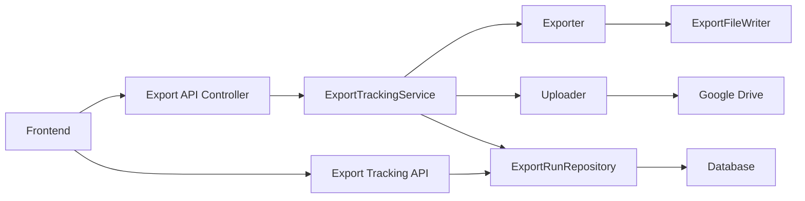

# Export Tracking Architecture Proposal

## Goals
- Track export runs by time and duration for all exporters (costs, influxdb, vocabulary).
- Persist tracking data in the database for frontend queries.
- Provide a minimal REST API for list and detail views.

## Current export entry points
- Costs export triggered in [api/src/main/java/com/marvin/api/controller/AdapterController.java](api/src/main/java/com/marvin/api/controller/AdapterController.java:51) using [exporter/src/main/java/com/marvin/export/costs/CostExporter.java](exporter/src/main/java/com/marvin/export/costs/CostExporter.java:28).
- Vocabulary export triggered in [api/src/main/java/com/marvin/api/controller/AdapterController.java](api/src/main/java/com/marvin/api/controller/AdapterController.java:57) using [exporter/src/main/java/com/marvin/export/vocabulary/VocabularyExporter.java](exporter/src/main/java/com/marvin/export/vocabulary/VocabularyExporter.java:16).
- Influx export triggered in [api/src/main/java/com/marvin/api/controller/InfluxExportController.java](api/src/main/java/com/marvin/api/controller/InfluxExportController.java:109) using [exporter/src/main/java/com/marvin/export/influxdb/InfluxExporter.java](exporter/src/main/java/com/marvin/export/influxdb/InfluxExporter.java:23).
- Upload performed in [uploader/src/main/java/com/marvin/upload/Uploader.java](uploader/src/main/java/com/marvin/upload/Uploader.java:44).

## Proposed components
1. **ExportTrackingService**
   - Orchestrates export runs, measures duration, captures status.
   - Wraps calls to exporters and uploader.
   - Responsible for creating and updating tracking records.

2. **ExportRun entity + repository**
   - New JPA entity for export runs.
   - Repository supports list and detail queries with filters.

3. **Export Tracking API**
   - New controller to expose tracking data to the frontend.
   - Read-only endpoints for list and detail.

4. **Migration**
   - New Flyway migration to create `export_run` table.

## Data model (export_run)
Suggested fields for persistence:
- `id` UUID or BIGINT
- `exporter_type` enum: COSTS, VOCABULARY, INFLUXDB
- `export_name` string (for bucket or sub-export name, for example TEMPERATURE)
- `status` enum: SUCCESS, FAILED
- `started_at` timestamp
- `finished_at` timestamp
- `duration_ms` bigint
- `exported_files` text or JSON (list of filenames)
- `upload_success` boolean
- `error_message` text
- `request_params` text or JSON (optional: start time, end time, bucket)

Notes:
- `duration_ms` derived from `finished_at - started_at` but stored for faster querying.
- `upload_success` records the outcome of [uploader/src/main/java/com/marvin/upload/Uploader.java](uploader/src/main/java/com/marvin/upload/Uploader.java:44).

## Minimal REST API proposal
Provide read endpoints that the frontend can query:

1. **List export runs**
   - `GET /exports`
   - Query params:
     - `from` ISO-8601 timestamp
     - `to` ISO-8601 timestamp
     - `type` enum: COSTS, VOCABULARY, INFLUXDB
     - `status` enum: SUCCESS, FAILED
     - `limit` and `offset`
   - Response: list of export runs with key fields

2. **Export run detail**
   - `GET /exports/{id}`
   - Response: full record including filenames, error, and request params

Optional extensions for later:
- `GET /exports/stats` with daily counts and average duration.

## Integration approach
1. Introduce `ExportTrackingService` in the API module.
2. Update controllers to call the tracking service instead of invoking exporters directly.
3. Export flow in tracking service:
   - Create `export_run` with `started_at`.
   - Call exporter and record filenames.
   - Call uploader and set `upload_success`.
   - Update `finished_at`, `duration_ms`, `status`, `error_message`.
4. Add `ExportTrackingController` for frontend access.

## Mermaid flow diagram

## Suggested implementation locations
- Entity and repository in [database/src/main/java/com/marvin/database](database/src/main/java/com/marvin/database:1) or a new module aligned with existing JPA usage.
- Migration in [database/src/main/resources/db/migration](database/src/main/resources/db/migration:1).
- Service and controller in [api/src/main/java/com/marvin/api](api/src/main/java/com/marvin/api:1).

