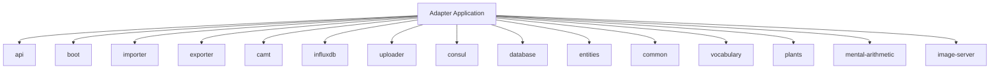

# Wiki Page Proposal — Adapter Application

## Summary

This document proposes a hierarchical wiki structure for the **Adapter Application** on the Wiki.js instance at `http://wiki.home-lab.com/`. The application is a multi-module Spring Boot 3.5 / Java 17 project following an orthogonal architecture. It handles data import, export, transformation, and upload across several domains: costs, sensor data, vocabulary, plants, mental arithmetic, and banking (CAMT).

No existing wiki pages were found for this application, so this will be a fresh documentation structure.

---

## Proposed Page Hierarchy

The structure consists of a single root page with one child page per Gradle module:

```
adapter-application/                          ← Root page: project overview, tech stack, architecture
├── api                                       ← REST controllers, DTOs, security config
├── boot                                      ← Spring Boot entry point, application.yaml
├── importer                                  ← File-based import pipeline: costs, sensors, vocabulary
├── exporter                                  ← Export pipeline: cost export, InfluxDB export
├── camt                                      ← CAMT.052 XML parsing, booking entry extraction
├── influxdb                                  ← InfluxDB write client, cost measurements
├── uploader                                  ← Google Drive upload/delete/list
├── consul                                    ← Consul KV config: IBANs, cost rules
├── database                                  ← JPA repositories, Flyway config
├── entities                                  ← JPA entity definitions
├── common                                    ← Shared DTOs, Jackson config, utilities
├── vocabulary                                ← Flashcard/deck CRUD, Wiktionary integration
├── plants                                    ← Plant care tracker: watering, fertilization
├── mental-arithmetic                         ← Arithmetic practice sessions and settings
└── image-server                              ← Image upload and retrieval service
```

---

## Mermaid Diagram — Page Hierarchy



---

## Page Content Outline

### Root: `adapter-application`
- Project name and brief description
- Tech stack summary: Java 17, Spring Boot 3.5, Spring WebFlux, PostgreSQL, InfluxDB, Consul, Google Drive API
- Orthogonal architecture overview with module dependency diagram
- Navigation links to all module pages

### Module pages (one per module)

Each module page will contain:
- **Purpose**: What the module does
- **Key classes**: Controllers, services, repositories, DTOs
- **Dependencies**: Which other modules it depends on
- **Configuration**: Relevant `application.yaml` properties
- **Data flow**: How data moves through the module

#### `api`
- Controllers: AdapterController, CamtController, ExportTrackingController, FileListController, InfluxExportController
- DTOs: ExportRunDTO, FileListResponse, FileDeleteResponse, InfluxBucketResponse, InfluxExportRequest, InfluxExportResponse
- Security configuration
- REST endpoint summary

#### `boot`
- Application entry point: `com.marvin.Application`
- `application.yaml` configuration reference
- Spring Boot assembly: how all modules are wired together

#### `importer`
- File-based import pipeline with DirectoryWatcher and Delegator
- Cost import: DailyCostImportService, MonthlyCostImportService, SalaryImportService, SpecialCostImportService
- Sensor data import: temperature, humidity, power data handlers
- Vocabulary import: VocabularyImporter
- Infrastructure: IBAN configuration from Consul

#### `exporter`
- AbstractExporterBase and ExportConfig
- CostExporter: exports cost data to files
- InfluxExporter: exports InfluxDB data with InfluxQueryBuilder
- ExportFileWriter: file output handling

#### `camt`
- CAMT.052.001.08 XML parsing with JAXB
- DocumentUnmarshaller and CamtFileParser
- Data maintenance: IbanMaintenance, NameMaintenance
- Booking entry model: BookingEntryDTO, MonthlyBookingEntriesDTO

#### `influxdb`
- InfluxDB client configuration
- GenericPojoImporter for writing measurements
- Cost measurement types: DailyCostMeasurement, MonthlyCostMeasurement, SalaryMeasurement

#### `uploader`
- Google Drive integration via GoogleDrive client
- Uploader: file upload to Google Drive
- FileLister and FileDeleter: file management operations
- DriveFileInfo model

#### `consul`
- Consul KV store integration
- BasicConsulRepository and specialized repositories: CostConsulRepository, MonthlyCostConsulRepository, SalaryConsulRepository, SpecialCostConsulRepository
- GeneralConfig and ConsulKeyValueDTO

#### `database`
- JPA repositories: DailyCostRepository, ExportRunRepository, MonthlyCostRepository, SalaryRepository, SpecialCostEntryRepository
- Flyway configuration and migration strategy
- Database migrations for costs schema

#### `entities`
- JPA entity definitions: BasicEntity base class
- Cost entities: DailyCostEntity, MonthlyCostEntity, SalaryEntity, SpecialCostEntity, SpecialCostEntryEntity
- Export entity: ExportRunEntity

#### `common`
- Shared DTOs: DailyCostDTO, MonthlyCostDTO, SalaryDTO, SpecialCostDTO, SpecialCostEntryDTO
- JacksonMapper configuration
- NullSafeUtil utility

#### `vocabulary`
- Flashcard and Deck CRUD operations
- Wiktionary dictionary integration via DictionaryClient
- FlashcardService with CSV import/export
- Database migrations for vocabulary schema

#### `plants`
- Plant care tracking: watering schedules, fertilization
- PlantController REST API
- PlantService with scheduled tasks
- Database migrations including Envers audit tables

#### `mental-arithmetic`
- Arithmetic practice sessions with configurable difficulty
- ArithmeticService: problem generation, session management, settings
- Entity model: sessions, problems, settings with operation types
- Database migration

#### `image-server`
- Image upload and retrieval service
- ImageController REST API
- ImageService and ImageRepository
- Database migration for images table

---

## Implementation Plan

The wiki pages will be created using the Wiki.js MCP tools. The implementation steps are:

1. Create the root page `adapter-application` with project overview and navigation
2. Create 15 child module pages under the root, each with module-specific documentation
3. Link source files to their corresponding wiki pages using `wikijs_link_file_to_page`
4. Verify the hierarchy using `wikijs_get_page_children`

---

## Total Page Count

| Section | Pages |
|---------|-------|
| Root page | 1 |
| Module pages | 15 |
| **Total** | **16 pages** |
